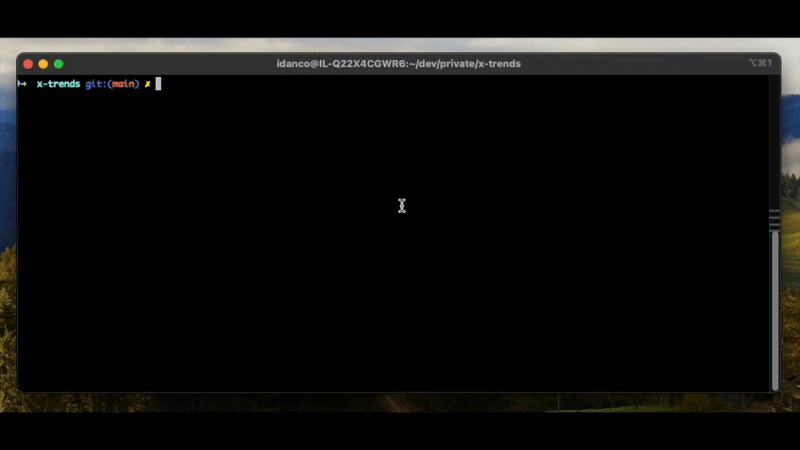

# Trends by X

Analyze X (Twitter) communities and get recent trends.



## Setup

1. Clone the repository
2. Install dependencies:

```bash
npm install
```

3. Create a `.env` file in the root directory with the following variables::
- `OPENAI_API_KEY`: Your OpenAI API key for trend analysis
- `X_AUTHORIZATION`: Authorization token for X API
- `X_CSRF_TOKEN`: CSRF token for X API
- `X_COOKIE`: Cookie value for X API authentication

## Usage

### Running the Application

```bash
# Development mode
npm run dev

# Build and run production version
npm run build
npm start
```

### Output

The application outputs:
- Analysis of the top 5 trending topics in the specified community
- Each trend includes a name, description, and percentage score

## Features

- Fetch tweets from these communities
- Analyze the content to identify the top 5 trending topics
- Each trend includes a name, description, and percentage score
- Visual representation of trend percentages

## Development

- The main agent logic is in `src/agent.ts`
- X scraper utilities in `src/x-scraper/`
- Tool definitions in `src/tools.ts`
- Type definitions in `src/types.ts`

## How it works

1. The agent takes a category as input
2. It resolves the most relevant X community ID for the category
3. It fetches tweets from that community
4. It uses OpenAI to analyze the tweets and identify the top 5 trends
5. Each trend is assigned a percentage based on its prominence

## Usage example
``` 
what's new in tech in the last 5 days?
```

## License

MIT 